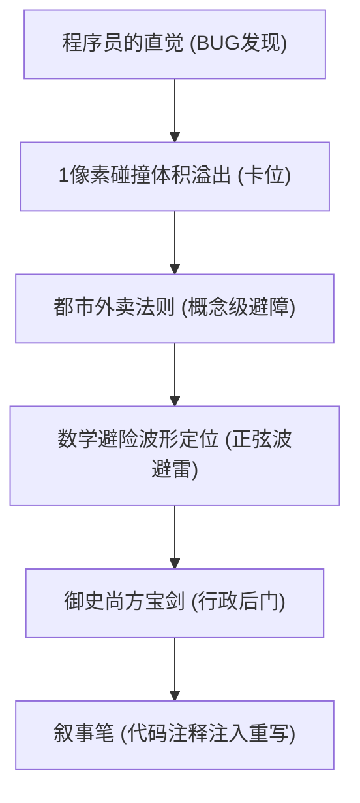

# 核心人物动态人设与阶梯能力小传

在由叙事引擎控制的世界中，人物的身份、记忆乃至肉身能力均会随着加载的“法则模块”而发生维度跃迁与动态热更新。以下是故事中核心人物的阶梯能力与角色档案。

---

## 1. 肖山 (Xiao Shan) — 叙事重写者与第零号变量

*   **角色定位**：落魄大厂架构师、外卖骑手、打破既定结局的唯一“第零号变量”。
*   **人设小传**：原为互联网准独角兽公司的大数据架构师，因裁员风暴而被迫“毕业”，又在股市中亏空积蓄（外号“小散”）。为了生计跨上电动车成为深夜外卖员。他拥有极致理性的程序员思维，在面对致命危险时能强行关闭多余情绪，将生存危机视为老项目代码的“Debug”过程，利用逻辑和系统漏洞实现硬核破局。
*   **身份动态更新轨迹**：
    `落魄大厂架构师` ➔ `深夜外卖骑手` ➔ `大乾正一品御史大夫` ➔ `因果金丹宿主` ➔ `终点执笔凡人（放弃神格）`

### 阶梯能力与核心技能

*   **【程序员的直觉（被动）】**：拥有 15% 概率发现当前所在系统/怪谈的逻辑漏洞。
*   **【碰撞体积检测溢出（主动卡BUG）】**：利用系统在物理沙盒重合判定上的 1 像素容错极限，人为制造大批实体堆叠，撑爆怪物判定模型。
*   **【都市外卖法则（概念级突防）】**：配送路径处于最高优先级，任何挡路的子弹、安保和障碍均会被物理规则判定为“需规避的路线阻碍”，自动偏离或避让。
*   **【天劫数学规避】**：利用傅里叶分析及正弦曲线波谷，精确计算天雷杀毒程序的冷却毫秒，在雷击缝隙中毫伤位移。
*   **【尚方宝剑行政后门】**：无视大乾帝国的官品气运威压限制，直接斩杀“补丁程序”化身的太师赵无极。
*   **【叙事笔·注释重写】**：直接在二维/三维世界底座写入“代码注释”，越过引擎的逻辑校验，强行定义现实。

---

## 2. 沈策 (Shen Ce) — 守护者与灵魂锚点

*   **角色定位**：冷酷执行官、肖山的终身羁绊对象、守护世界线收敛的“第一守护者”。
*   **人设小传**：在不同的叙事模块中被系统赋予了完全不同的人设（如冷血的清理执行官、手握重权的大乾锦衣卫最高长官、千亿豪门继承人等）。他被系统清空和格式化了上百次记忆，但每次重逢都会在与肖山的物理接触中重新觉醒。性格坚毅、孤傲而隐忍，在多次轮回中默默充当肖山的后盾，甘愿为了肖山的逃生而牺牲自己的数据本源。
*   **身份动态更新轨迹**：
    `终点清除官` ➔ `大乾锦衣卫指挥使（武道七品）` ➔ `千亿财阀大少/继承人` ➔ `数据通道（替伤牺牲者）` ➔ `叙事引擎第一守护者`

### 阶梯能力与核心技能
*   **【武道七品·断镣折梅】**：在大乾武侠沙盒中拥有顶级的近战物理和刀法（唐刀）杀伤力，能以肉身剑气斩断高维机械臂。
*   **【甜宠强制羁绊·生命共感】**：通过红线烙印与肖山共享100%的生命值与痛觉。当一方受伤，另一方即刻分担，保证只要有一人存活，双方都不会彻底消散。
*   **【数据通道单向替伤】**：利用自己守护者权限底座的漏洞，主动在底层逻辑上降级为“数据管道”，强制将肖山受到的所有系统抹杀指令和格式化数据重定向到自己身上，替肖山承受灭顶之灾。

---

## 3. 董昔瑶 / 昔瑶 (Dong Xiyao) — 原初设计者与守护意志

*   **角色定位**：配送站长/守门人、肖海川的大学导师、终点塔最深处的程序投影。
*   **人设小传**：初登场时是外卖站点的清冷站长，长发，爱喝白梅花茶，用青瓷杯续水。真实身份是肖山父亲肖海川的大学导师，早在肖山父母之前就参与了叙事引擎的理论奠基。引擎失控后成为林江市的守门人，三十年守城，最终化为虚无。在第一纪元崩溃后，她的部分意志残影被埋入终点塔，成为系统的最高修正机制维护者，负责不断运行剧情杀以清除肖山和沈策这两个异常线程。
*   **核心能力**：
    *   **【十秒时空闭环】**：强制锁定局部时空，每十秒执行一次时间回溯，仅自己能保持记忆和行动连贯，用于将入侵者彻底困死在时间囚笼中。
    *   **【叙事模块重组（DLL调度）】**：可随时调动并随意拼凑世界的十一种叙事法则，在一秒内切换重力、重力归零、修仙灵气枯竭和丧尸病毒等。
    *   **【虚无化吞噬】**：操控无序的数据黑影，将触及的一切物理和代码实体彻底概念抹除（虚无化）。

---

## 4. 李秀芬 (Li Xiufen) — 安全专家与记忆守门人

*   **角色定位**：沈氏集团安全工程师、林知意（肖山母亲）唯一的学生、硬件逆向专家。
*   **人设小传**：25岁，IT部门技术骨干。曾在多次“世界格式化”中存活，右半脸和右臂留有严重的淡蓝色“像素化数据伤痕”。她十七岁起就跟随林知意从事叙事引擎的研发，一直在老城区经营电路维修铺，静等肖山觉醒。她是肖山揭开父母失踪真相、复原核心文件的关键推手。
*   **核心能力**：
    *   **【物理/数据直接接驳】**：她的半像素化右臂可以直接插入服务器的物理接口，以身体为媒介与异常数据流直接对抗。
    *   **【语义解压缩算法】**：能够从被叙事引擎极限压缩的底层碎片（如照片、残留芯片）中，通过语义编码逻辑完美复原原图。

---

## 5. 阿雅 (Aya) — 编外技术支援与黑客

*   **角色定位**：天才女黑客、肖山的前同事与技术后援。
*   **人设小传**：肖山在大厂时的同事，紫色乱蓬发，咬着棒棒糖，手腕戴静电手环，敲键盘速度极快，养了一只叫”Bug”的三花猫。从林江市出现第一道异常数据裂缝起，她已连续监控三个月，等着肖山的求助电话。手焊破维解密芯片”老夏”（以已故导师命名），在Ch20芯片烧毁后，换了一块新芯片叫”小临”。
*   **核心能力**：
    *   **【手焊破维解密芯片】**：逆向开发系统，将芯片装在肖山手机内，使其视网膜能够投射出当前环境的所有参数网格（动作帧数、碰撞缝隙、血条耐久等）。
    *   **【UDP洪水端口轰炸】**：擅长利用高频数据包将屏幕厉鬼的判断流程瘫痪，从而卡出安全区。

---

## 6. 陈宇 (Chen Yu) — 调查者与损友后盾

*   **角色定位**：肖山的大学室友、独立播客"林江市失踪事件调查"主理人。
*   **人设小传**：给肖山起外号"小散"的损友。私下整理了五年间十七起外卖骑手在临渊路失踪的案件记录。城市崩溃时背上登山包进入避难所，沿途收留邻居，用自制爬虫系统追踪终点塔数据。最后在咖啡馆与肖山重逢，把调查到的翠微山白楼情报推到他面前，说"做播客的嘛，查资料是本能。"
*   **核心作用**：提供沈策的大学学长线索(Ch02)；在通讯中断前将肖山最后的"别怕"截图上传云端。

## 7. 老黄 (Lao Huang) — 连接两代人的信使

*   **角色定位**：前外卖骑手，连接肖山与父母的关键人物。
*   **人设小传**：骑了十五年车。十五年前给307室的林知意送黄焖鸡时，目睹她抱着婴儿肖山在哭。此后默默守护，在笔记本上写"307室，林女士。以后这单不管多远我都自己送。"在雨夜消失前把外卖箱留给老板娘，说"以后会有人来取的"。笔记本后来被昔瑶找到，上面多了一行后来补上的字："对不起，没能送到最后。"
*   **核心作用**：外卖箱藏着十五年前的外卖单(有林知意和肖海川的签名)，成为Ch18穿越回十年前的钥匙。

## 8. 林知意 & 肖海川 — 造物主父母

*   **林知意 (Lin Zhiyi)**：肖山的母亲，叙事引擎核心创造者。用打字机写故事为五岁垂死的肖山改写现实。引擎失控后假装失踪躲入地下实验室。在十年前实验室大火中把叙事笔递到肖山手中："去写属于你自己的结局。"左手腕的条形码印记和肖山一模一样——是她留给儿子的最后一道保护。
*   **肖海川 (Xiao Haichuan)**：肖山的父亲，与林知意共同研发引擎。记忆中憨厚温和，实验室里却是头发乱成鸟窝、用生命和代码赛跑的研究者。火海中转身挡住昔瑶追来的方向。
*   **核心作用**：叙事引擎创造者。Ch19穿越揭示真相。Ch29短信"祝贺通关，儿子"证明仍存活于某个维度。

## 9. 沈绮 (Shen Qi) — 镜中人

*   **角色定位**：Ch21反派，代号"镜中人"，复制他人能力但每次失去部分记忆。
*   **人设小传**：曾是普通高中生，母亲去世后接受镜中人能力——每次复制别人的记忆都能短暂感受"有妈妈是什么感觉"。复制了太多人的妈妈，最后忘记了自己母亲的长相。临死前喊的"妈妈"是她唯一记得的词。融化前嘴角浮起近乎幸福的弧度。
*   **核心作用**：悲剧反派，展现昔瑶操控下牺牲品的命运。

## 10. 赵德胜 (Zhao Desheng) — 资本化身

*   **角色定位**：肖山前公司老板，Ch04精英怪。
*   **人设小传**：因肖山拒绝996加班而将其开除并扣工资。在游戏化沙盒中被建模为精英怪"赵德胜·资本化身"(Lv.5，HP3500)，手持KPI大棒，技能包括"资本咆哮"和"压榨光环"。被肖山利用2毫秒动画帧延迟漏洞风筝至死，掉落大乾通宝。

## 11. 赵无极 (Zhao Wuji) — 补丁化身

*   **角色定位**：大乾王朝太师，叙事引擎补丁程序化身，Ch15终极BOSS。
*   **人设小传**：渡劫期九重天，把持朝政多年，与国运真龙绑定。在金銮殿上被肖山用微积分算干气运、用尚方宝剑物理超度。死后化作补丁程序代码残卷。
